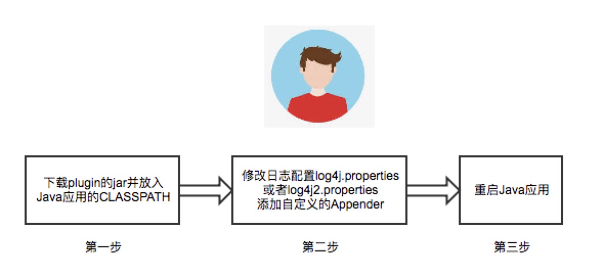
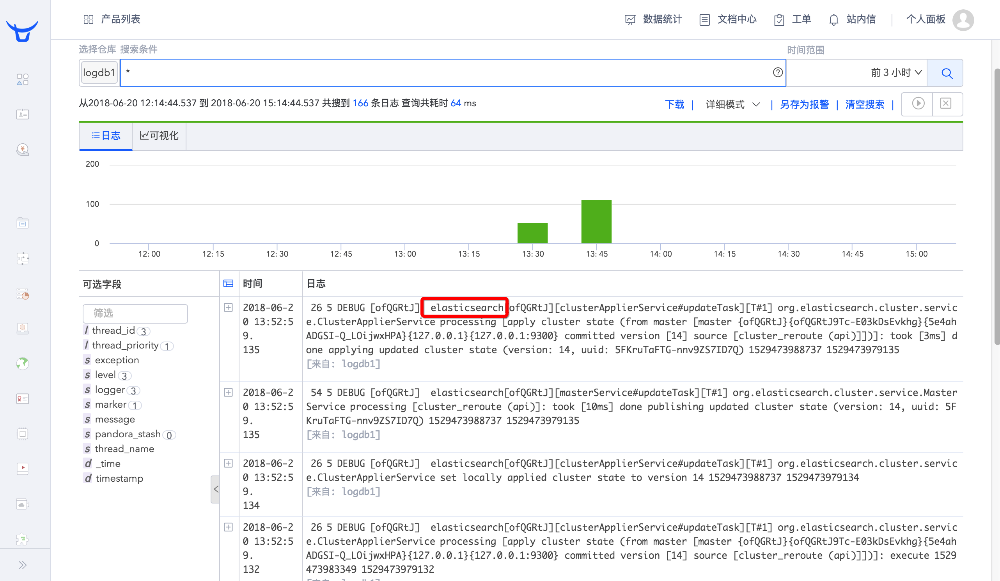

# 轻松推送Java应用日志到七牛云平台

云计算发展至今，企业应用的方方面面都已经在云上或者准备上云了。无论是Iaas还是Paas，应用开发的首选即是上云，因为云平台不仅可以节约开发和部署流程中的时间，而且专业的云平台还会极大提升整体服务的稳定性。

本篇主要介绍下如何利用七牛云大数据日志平台来无缝收集Java应用日志，方面后续的日志分析等工作。本质上，任何客户如果希望接入七牛的大数据日志平台，都可以利用各个语言的SDK来完成这个工作,或者利用七牛提供的收集工具如[logkit](https://github.com/qiniu/logkit) 或者 [企业级logkit](https://logkit-pro.qiniu.com/#/)。

但是本方案强调的就是 **业务代码无侵入性**。

提供**业务代码无侵入性**接入的方案最基本的原因就是：

1. 客户已有的Java应用已经会把日志存储到本地或者其他的地方，支持新的输出需要修改业务代码，而大部分情况下客户不希望这样做
2. 客户希望能够快速体验新的日志输出方案，希望尽可能少地影响现有的业务运行

最好存在一种方案，可以支持**可插拔**的方式来推送日志，这样Java应用代码不需要做更改，也就是达到 **业务代码无侵入性**。

由于大多数客户的应用都是采用Java来开发的，而且由于Java的生态发展的非常完善，很多客户都使用成熟的日志框架如log4j，slf4j，logback等来进行日志的输出。而这些框架在设计上面为我们无缝输出日志到不同的目的地提供了方便的接口。

所以，基于这些背景，我们打算帮助客户实现Java应用日志的**无缝快速上云**。

很多人或许已经猜出了这个方案的核心技术就是开发支持各个日志框架的自定义Appender。

对，就是这样。我们目前优先选择支持Java最主要是Java语言的覆盖用户广泛，日志框架设计优良，后续根据需求继续支持其他的语言。

这个方案除了自定义日志的Appender来将日志输出到云端外，还内部实现了多线程日志上传，日志缓冲（避免频繁推送大小很小的日志行），定时推送等功能，后续还会根据实际情况继续支持企业级需求。

实际应用起来非常简单，无需修改一行业务代码，直接看图：
 

启动服务后，日志会进行上报，可以在七牛云后台查看数据：

另外，为了让大家实际体验下，我们还提供了两个开源软件的案例：

[ElasticSearch日志收集案例](https://github.com/qiniu/qiniu-logging-plugin/wiki/ElasticSearch%E6%97%A5%E5%BF%97%E6%94%B6%E9%9B%86%E6%A1%88%E4%BE%8B)

[Apache Kafka日志收集案例](https://github.com/qiniu/qiniu-logging-plugin/wiki/Apache-Kafka%E6%97%A5%E5%BF%97%E6%94%B6%E9%9B%86%E6%A1%88%E4%BE%8B)

如果您有兴趣了解更多实现细节，欢迎 Star项目：https://github.com/qiniu/qiniu-logging-plugin 。
